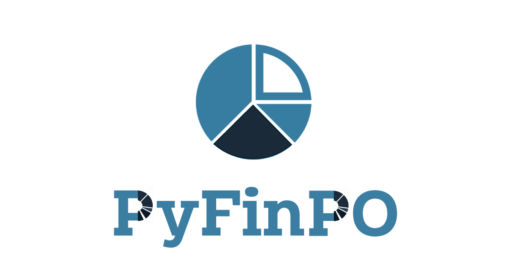
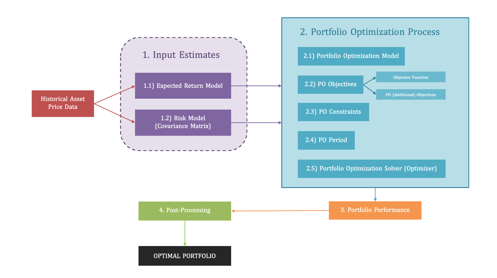
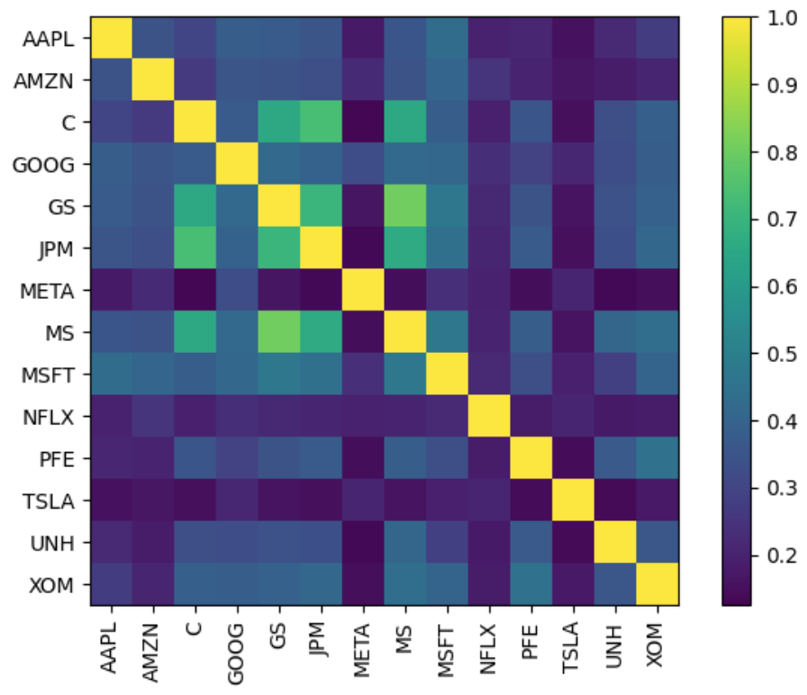
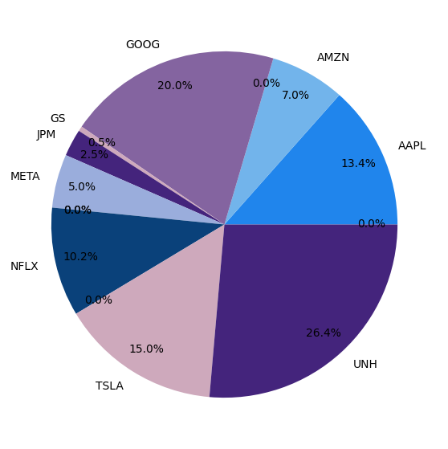

</br>




<!-- buttons -->
<p align="center">
    <a href="https://www.python.org">
        </a> &nbsp;
    <a href="https://www.python.org">
        </a> &nbsp;
</p>

</br>

# ``PyFinPO`` - Python Financial Portfolio Optimization

Welcome to PyFinPO, my personal library for Financial Portfolio Optimization in Python.  

PyFinPO is an abstraction of other Python libraries for Portfolio Optimization ([PyPortOpt](https://github.com/robertmartin8/PyPortfolioOpt), [skfolio](https://github.com/skfolio/skfolio), [scikit-learn](https://scikit-learn.org/), [cvxpy](https://www.cvxpy.org/)...), aiming to provide a structured, simple and extensible infrastructure to perform Financial Portfolio Optimization.


## Context
When I first set out to develop a Portfolio Optimization Library in Python, my goal was simple: to gain a deep understanding of portfolio theory and its main methods. Building everything from scratch felt like the best way to learn the nuances of the different models, approaches, estimators... and their implementations.

However, as I started exploring the existing Portfolio Optimization libraries in Python, I discovered that there are already VERY GOOD resources available for free ([see list below](#source-libraries)). I quickly came to the realization that it made no sense to implement my own portfolio tool from scratch having all those open-source libraries available –tested and improved through user feedback– that already included most of the Portfolio Optimization tools needed. Reinventing the wheel no longer seemed practical or efficient.

So I changed my mind. Instead of creating yet another standalone library, I decided that in order to understand the nuances of Portfolio Optimization, it would make more sense for me to build a centralized library which organizes the different functionalities available in other open-source libraries under a single, cohesive API. By integrating their strengths with an intuitive high-level interface, this tool could help me (and potentially other users) to seamlessly access the best functionalities each library has to offer without needing to master multiple APIs.

Additionally, I decided to prioritize modularity and extensibility, making extremely easy to add new proprietary models and integrate them in the buit-in API with minimal effort.

In a nutshell, I defined 3 main principles for the project: unified structure, intuitive use, and scalable modularity.


## Objectives

PyFinPO aims to satisfy 3 main objectives:

1. To unify the different Portfolio Optimization functionalities offered in other libraries under a common, structured API.
2. To provide a high-level interface to intuitively perform Portfolio Optimization with Python.
3. To offer a MODULAR and EXTENSIBLE tool which anyone can use to build proprietary models and feed them into the created API structure to leverage the already implemented functionalities in existing libraries.


## Note
> Please note that PyFinPO Library is still under construction, therefore many of the functionalities have not been implemented yet. The summary tables below detail all the necessary information about the functionalities, documentation links and source code status for each model.


</br>

# Table of Contents

1) [Installation](#1-installation)
2) [Library Structure](#2-library-structure)
3) [PyFinPO Features](#3-features)
    - 3.0) [Portfolio Selection Problem Overview]()
    - 3.1) [Input Estimates](#31-input-estimators)
        - 3.1.1) [Expected Return Models](#311-expected-return-models)
            - [Historical Averages](#historical-averages)
            - [Economic & Factor Models](#economic--factor-models)
            - [Statistical/Machine Learning Models](#statisticalmachine-learning-models)
            - [Hybrid Models](#hybrid-models)
        - 3.1.2) [Risk Models](#312-risk-models)
            - [Covariance Estimators](#covariance-estimators)
            - [Covariance Shrinkage](#covariance-shrinkage)
            - [Sparse Inverse Covariance Estimators](#sparse-inverse-covariance-estimators)
            - [Robust Covariance Estimators](#robust-covariance-estimators)

    - 3.2) [Portfolio Optimization](#32-portfolio-optimization-po)
        - 3.2.1) [Portfolio Optimization Models](#321-portfolio-optimization-models)
            - [Naive PO Models](#naive-po-models)
            - [Risk-Based PO Models](#risk-based-po-models)
            - [Mean-Risk PO Models](#mean-risk-po-models)
            - [Robust Mean-Risk Models](#robust-mean-risk-po-models)
            - [Clustering PO Models](#clustering-po-models)
            - [Ensemble PO Models](#ensemble-po-models)
        - 3.2.2) [Portfolio Optimization Objectives](#322-portfolio-optimization-objectives)
            - [Objective Functions](#objective-functions)
            - [Adding Custom Objectives](#adding-custom-objectives)
            - [Sinlge-Objective vs Multi-Objective Optimization]()
        - 3.2.3) [Portfolio Optimization Constraints](#323-portfolio-optimization-constraints)
        - 3.2.4) [Portfolio Optimization Period](#324-portfolio-optimization-period)
        - 3.2.5) [Portfolio Optimization Solver (Optimizer)](#325-portfolio-optimization-solver-optimizer)

    - 3.3) [Portfolio Performance](#33-portfolio-performance)

    - 3.4) [Portfolio Optimization Post-Processing](#34-portfolio-optimization-post-processing)
        - 3.4.1) [Portfolio Tidy Weights](#341-portfolio-tidy-weights)
        - 3.4.2) [Portfolio Discrete Allocation](#342-portfolio-discrete-allocation)
          
4) [Future Works](#4-future-works)
5) [Source Libraries](#5-source-libraries)


</br>

# 1) Installation
If you would like to install ``PyFinPO``, you can try any of the following 3 options:

 1. Clone the project and use the source code:

 ```bash
 git clone https://github.com/alvarosf07/pyfinpo
 ```

 2. Alternatively, you can just install the project directly from your terminal:

 ```bash
 pip install -e git+https://github.com/alvarosf07/pyfinpo.git
 ```
 
 3. However, it is best practice to use a dependency manager within a virtual environment. You can import all the dependencies within ``PyFinPO`` to your local environment by cloning/downloading the project and then in the project directory just can just run:

 ```bash
 python setup.py install
 ```

 </br>

# 2) Library Structure
 - ``config`` - library configuration files
 - ``data`` - stores datasets of raw, processed or forecasted asset prices/returns
 - ``docs`` - documentation for the different models and functions/classes of the library
 - ``media`` - images, files other media content used in the library
 - ``pyfinpo`` - library source code. See [Features](#3-features) section for full details.
 - ``scripts`` - python scripts with diverse contents and applications
 - ``tests``- test implementations of all the different functionalities of the library
 - ``tutorials`` - tutorials and practical use cases of implementations with PyFinPO


</br>


# 3) ``PyFinPO`` Features

## 3.0) Overview of Portfolio Selection Problem

Portfolio optimization, as formalized by Harry Markowitz in his seminal 1952 paper "Portfolio Selection," revolutionized investment theory by introducing a systematic and quantitative framework. Markowitz demonstrated that by combining assets with differing expected returns and volatilities, investors can construct portfolios that either minimize risk for a given return or maximize return for a specific level of risk. These optimal portfolios form the efficient frontier, a cornerstone of what is now known as Modern Portfolio Theory (MPT).

At the heart of Markowitz’s framework is mean-variance optimization, which requires two key inputs: estimates of expected returns and a covariance matrix to capture asset interdependencies. While the model provides a theoretically optimal solution, its practical application is limited by the difficulty in accurately forecasting these inputs. Historical data is often used as a proxy, though this approach sacrifices the theoretical guarantees of precision.

Advancements in portfolio optimization have expanded upon these ideas, introducing diverse objective functions and measures of risk such as maximizing Sharpe ratios or minimizing Conditional Value at Risk (CVaR). Constraints such as budget limits, sector exposure, or regulatory requirements are incorporated to reflect real-world considerations.

Therefore, we can divide portfolio optimization process in 4 main steps, each with their own sub-steps. These depicted in the Figure below, and fully detailed in the following section.



</br>

## 3.1) Input Estimators

### 3.1.1) Expected Return Models

#### Historical Averages
| Model Tag         | Model Name                                           | Documentation                                                               | Implementation                                                                  |
|-------------------|----------------------------------------------------- |---------------------------------------------------------------------------- |---------------------------------------------------------------------  |
| ``mh_rm``         | Mean Historical Return Model  (aka Empirical Returns)                       | [PyPortOpt](https://pyportfolioopt.readthedocs.io/en/latest/ExpectedReturns.html#pypfopt.expected_returns.mean_historical_return)  | [mh_rm.py](./pyfinpo/input_estimates/expected_return_models/mh_rm.py)   |
| ``ewmh_rm``       | Exponentially Weighted Mean Return Model             | [PyPortOpt](https://pyportfolioopt.readthedocs.io/en/latest/ExpectedReturns.html#pypfopt.expected_returns.ema_historical_return)   | [ewmh_rm.py](./pyfinpo/input_estimates/expected_return_models/ewmh_rm.py)  |
| ``mceq_rm``       | Market Cap Equilibrium Expected Return Model             | [skfolio](https://skfolio.org/generated/skfolio.moments.EquilibriumMu.html)   | *To be implemented*  |
| ``eqweq_rm``       | Equal Weight Equilibrium Expected Return Model             | [skfolio](https://skfolio.org/generated/skfolio.moments.EquilibriumMu.html)   | *To be implemented*  |


#### Economic & Factor Models
| Model Tag         | Model Name                                               | Documentation                                                               | Implementation                                                                  |
|-------------------|--------------------------------------------------------- |---------------------------------------------------------------------------- |---------------------------------------------------------------------  |
| ``capm_rm``       | Capital Asset Pricing Return Model (Equilibrium)         | [PyPortOpt](https://pyportfolioopt.readthedocs.io/en/latest/ExpectedReturns.html#pypfopt.expected_returns.capm_return)   | [capm_rm.py](./pyfinpo/input_estimates/expected_return_models/capm_rm.py) |
| ``apt_rm``        | Arbitrage Pricing Theory (APT) Return Model              | [See docs](https://www.fe.training/free-resources/portfolio-management/arbitrage-pricing-theory/)   | _To be implemented_ |
| ``fama_factor_rm``| Fama-French Three-Factor Return Model                    | [See docs](https://en.wikipedia.org/wiki/Fama%E2%80%93French_three-factor_model)   | _To be implemented_ |
| ``multi_factor_rm``| Multi-Factor Return Models        | [skfolio](https://skfolio.org/auto_examples/1_mean_risk/plot_13_factor_model.html#factor-model)   | _To be implemented_ | 


#### Statistical/Machine Learning Models
- **Shrinkage Estimators** -> The estimator shrinks the sample mean toward a target vector.
- **Regression-Based Return Models** -> Predict future returns using historical and fundamental data
- **Bayesian Models** -> Model relationships between variables and incorporate new information/views to estimate probabilistic returns.
- **Time-Series Forecasting Return Models**
- **Supervised ML Models** -> Support Vector Machines, Gradient Boosting, Random Forests...
- **Neural Networks** -> Capture non-linear relationships and patterns, suitable for complex datasets.


| Model Tag              | Model Name                                               | Documentation                                                          | Implementation                                                                      |
|------------------------|--------------------------------------------------------- |------------------------------------------------------------------------|---------------------------------------------------------------------------|
| | | | |
| **Shrinkage Estimators**  | | | |
| ``shrinkage_rm``  | Shrinkage Return Models Estimators                       | [skfolio - Expected Return Shrinkage](https://skfolio.org/generated/skfolio.moments.ShrunkMu.html#skfolio.moments.ShrunkMu)   | _To be implemented_ |
| ``shrinkage_rm.james_stein``  | Shrinkage Return Models - James-Stein        | [skfolio - Expected Return Shrinkage](https://skfolio.org/generated/skfolio.moments.ShrunkMu.html#skfolio.moments.ShrunkMu)   | _To be implemented_ |
| ``shrinkage_rm.bayes_stein``  | Shrinkage Return Models - Bayes-Stein        | [skfolio - Expected Return Shrinkage](https://skfolio.org/generated/skfolio.moments.ShrunkMu.html#skfolio.moments.ShrunkMu)  | _To be implemented_ |
| ``shrinkage_rm.bop``  | Shrinkage Return Models - Bodnar Okhrin Parolya      | [skfolio - Expected Return Shrinkage](https://skfolio.org/generated/skfolio.moments.ShrunkMu.html#skfolio.moments.ShrunkMu)  | _To be implemented_ |
| **Bayesian Models**  | | | |
| ``black_litterman_rm``       |  Black Litterman Model (return + risk model)        | [PyPortOpt - Black-Litterman](https://pyportfolioopt.readthedocs.io/en/latest/BlackLitterman.html)  | [black_litterman_rm.py](./pyfpo/input_estimates/robust_models/black_litterman_rm.py) |
<!-- | ``TBD``       |  -        | [Bayesian Predictive Return Distributions](https://www.ecb.europa.eu/pub/pdf/scpwps/ecbwp969.pdf)   | _To be implemented_ |
| **Regression-Based Return Models**  | | | |
| ``TBD``       |          | []()   | _To be implemented_ |
| **Time-Series Forecasting Return Models**  | | | |
| ``TBD``       |          | []()   | _To be implemented_ |
| **Supervised ML Models**  | | | |
| ``TBD``       |          | []()   | _To be implemented_ |
| **Neural Networks**  | | | |
| ``TBD``       |         | []()   | _To be implemented_ | -->


#### Hybrid Models
Combine any of the previous models for more robust estimates.
| Model Tag         | Model Name                                               | Documentation                                                               | Code                                                                  |
|-------------------|--------------------------------------------------------- |---------------------------------------------------------------------------- |---------------------------------------------------------------------  |
| ``TBD``           |  -         | []()   | _To be implemented_ |


</br>

### 3.1.2) Risk Models

#### Covariance Estimators
| Model Tag              | Model Name                                               | Documentation                                                          | Code                                                                      |
|------------------------|--------------------------------------------------------- |------------------------------------------------------------------------|---------------------------------------------------------------------------|
| ``sample_cov``         | Sample Covariance Risk Model                             | [RiskModels.md](./docs/input_estimates/RiskModels.md)                  | [sample_cov.py](./pyfpo/input_estimates/risk_models/sample_cov.py)        |
| ``empirical_cov``      | Empirical Covariance (Max Likelihood Covariance Estimator)  | [Scikit-learn](https://scikit-learn.org/1.5/modules/covariance.html#empirical-covariance)                     | _To be implemented_             |
| ``implied_cov``        | Implied Covariance Risk Model                            | [Implied Covariance Matrix](https://users.ugent.be/~yrosseel/lavaan/evermann_slides.pdf)                         | _To be implemented_             |
| ``semi_cov``           | Semi-covariance Risk Model   | [Semi-Covariance Matrix](https://random-docs.readthedocs.io/en/latest/portfolio_optimisation/risk_estimators.html#semi-covariance-matrix)    | [semi_cov.py](./pyfpo/input_estimates/risk_models/semi_cov.py)  |
| ``ew_cov``             | Exponentially-Weigthed Covariance Risk Model             | [EW Covariance Matrix](https://random-docs.readthedocs.io/en/latest/portfolio_optimisation/risk_estimators.html#exponentially-weighted-covariance-matrix)                  | [ew_cov.py](./pyfpo/input_estimates/risk_models/ew_cov.py)                |
| ``cov_denoising``      | Covariance Denoising Risk Model                          | [Covariance Denoising](https://random-docs.readthedocs.io/en/latest/portfolio_optimisation/risk_estimators.html#de-noising-and-de-toning-covariance-correlation-matrix)  | _To be implemented_                |
| ``cov_detoning``       | Covariance Detoning Risk Model                          | [Covariance Detoning](https://random-docs.readthedocs.io/en/latest/portfolio_optimisation/risk_estimators.html#de-toning)  | _To be implemented_             |


#### Covariance Shrinkage
| Model Tag              | Model Name                                               | Documentation                                                          | Code                                                                      |
|------------------------|--------------------------------------------------------- |------------------------------------------------------------------------|---------------------------------------------------------------------------|
| ``cov_shrinkage``      | Covariance Shrinkage Risk Models                         | [RiskModels.md](./docs/input_estimates/RiskModels.md)                  | [cov_shrinkage.py](./pyfpo/input_estimates/risk_models/cov_shrinkage.py)  |
| ``cov_shrinkage.shrunk_covariance``    | Covariance Shrinkage - Manual Shrinkage     | [RiskModels.md](./docs/input_estimates/RiskModels.md)               | [cov_shrinkage.py](./pyfpo/input_estimates/risk_models/cov_shrinkage.py)  |
| ``cov_shrinkage.ledoit_wolf``          | Covariance Shrinkage - Ledoit-Wolf          | [RiskModels.md](./docs/input_estimates/RiskModels.md)               | [cov_shrinkage.py](./pyfpo/input_estimates/risk_models/cov_shrinkage.py)  |
| ``cov_shrinkage.oracle_approximating`` | Covariance Shrinkage - Oracle Approximating | [RiskModels.md](./docs/input_estimates/RiskModels.md)               | [cov_shrinkage.py](./pyfpo/input_estimates/risk_models/cov_shrinkage.py)  |


#### Sparse Inverse Covariance Estimators
| Model Tag              | Model Name                                               | Documentation                                                          | Code                                                                      |
|------------------------|--------------------------------------------------------- |------------------------------------------------------------------------|---------------------------------------------------------------------------|
| ``graph_lasso_cov``    | Sparse Inverse Graphical Lasso Covariance Estimator         | [Scikit-learn](https://scikit-learn.org/1.5/modules/covariance.html#sparse-inverse-covariance)          | _To be implemented_                |


#### Robust Covariance Estimators
| Model Tag              | Model Name                                               | Documentation                                                          | Code                                                                      |
|------------------------|--------------------------------------------------------- |------------------------------------------------------------------------|---------------------------------------------------------------------------|
| ``mcd_cov``            | Robust Minimum Covariance Determinant (MCD) Estimator    | [Scikit-learn](https://scikit-learn.org/1.5/modules/covariance.html#robust-covariance-estimation)                | _To be implemented_             |
| ``gerber_cov``         | Robust Gerber Statistic for Covariance Estimation        | [The Gerber Statistic](https://portfoliooptimizer.io/blog/the-gerber-statistic-a-robust-co-movement-measure-for-correlation-matrix-estimation/)    | _To be implemented_ |

</br>

##### Quick Example
```python
from pyfinpo.input_estimates import risk_models

cov_matrix = risk_models.sample_cov(prices)
po_plotting.plot_covariance(sample_cov, plot_correlation=True)
plt.show()
```


</br>

## 3.2) Portfolio Optimization (PO)
Once the input estimates have been determined, we can proceed with the portfolio optimization process.

### 3.2.1) Portfolio Optimization Models
The first step of the portfolio optimization is to choose the optmization model/framework. The model of choice is going to determine the type of approach we want for the portfolio optimization, the different objective functions that we will be able to optimize for, and the solver used to approach the optimization problem, among other things. As we will see later on, each optimization model/framework has its particular objective functions and solvers/optimizers. 

The following Portfolio Optimization Models have been/will be implemented:

#### Naive PO Models
| Model Tag              | Model Name                                               | Documentation                                                          | Code                                                                      |
|------------------------|--------------------------------------------------------- |------------------------------------------------------------------------|---------------------------------------------------------------------------|
| ``eqw_po``             | Equal Weight (1/N) Portfolio Optimization                | [skfolio](https://skfolio.org/generated/skfolio.optimization.EqualWeighted.html#skfolio.optimization.EqualWeighted)           | _To be implemented_             |
| ``ivp_po``             | Inverse Volatility Portfolio (IVP) Optimization          | [skfolio](https://skfolio.org/generated/skfolio.optimization.InverseVolatility.html#skfolio.optimization.InverseVolatility)   | _To be implemented_             |
| ``random_po``          | Random Portfolio Optimization (Dirichlet Distribution)   | [skfolio](https://skfolio.org/generated/skfolio.optimization.Random.html#skfolio.optimization.Random)                         | _To be implemented_             |

#### Risk-Based PO Models
| Model Tag              | Model Name                                               | Documentation                                                          | Code                                                                      |
|------------------------|--------------------------------------------------------- |------------------------------------------------------------------------|---------------------------------------------------------------------------|
| ``gmv_po``*        | Global Minimum Variance PO                       | [PyPortOpt](https://pyportfolioopt.readthedocs.io/en/latest/MeanVariance.html#pypfopt.efficient_frontier.EfficientFrontier.min_volatility), [GMVP](http://showcase2.imw.tuwien.ac.at/BWOpt/PF1_minvar.html) | _To be implemented_    |
| ``maxdiv_po``*     | Maximum Diversification Portfolio Optimization   | [skfolio](https://skfolio.org/generated/skfolio.optimization.MaximumDiversification.html#skfolio.optimization.MaximumDiversification) | _To be implemented_    |
| ``risk_parity_po``     | Risk Parity Portfolio Optimization                       | [skfolio](https://skfolio.org/generated/skfolio.optimization.RiskBudgeting.html), [Risk Parity PO](https://tspace.library.utoronto.ca/bitstream/1807/106376/4/Costa_Del_Pozo_Giorgio_202106_PhD_thesis.pdf) | _To be implemented_    |
| ``risk_budgeting_po``  | Risk Budgeting Portfolio Optimization                    | [skfolio](https://skfolio.org/generated/skfolio.optimization.RiskBudgeting.html), [Risk Budgeting PO](http://www.columbia.edu/~mh2078/A_generalized_risk_budgeting_approach.pdf)                            | _To be implemented_    |

- **Both ``gmv_po`` and ``maxdiv_po`` are not implemented as strict PO models, but as objective functions for optimization inside other PO models (such as Mean-Risk Models detailed below).*

#### Mean-Risk PO Models
Mean-Risk Portfolio Optimization models aim to find asset combinations which optimize the relationship return vs risk. The most well-known Mean-Risk model is Mean-Variance Portfolio Optimization, which uses the variance of asset returns as measure of risk. However, many different measures of risk can be selected, giving rise to a wide range of Mean-Risk models. 

``PyFinPO`` provides direct implementation of the most relevant Mean-Risk models, as detailed in the summary table below (Mean-Variance, Mean-Semivariance, Mean-CVaR, Mean-CDaR). In order to select any other measure of risk which is not directly implemented in the PO models below, the parent class ``MeanRiskPO`` generalizes all mean-risk models and allows to choose among any of the available risk metrics (see list below).

| Model Tag              | Model Name                                               | Documentation                                                          | Code                                                                      |
|------------------------|--------------------------------------------------------- |------------------------------------------------------------------------|---------------------------------------------------------------------------|
| ``mr_po``              | Mean-Risk Portfolio Optimization (generalizes all models below)                                | [skfolio](https://skfolio.org/generated/skfolio.optimization.MeanRisk.html)  | _To be implemented_             |
| ``mv_po``              | Mean-Variance Portfolio Optimization                             | [PyPortOpt](https://pyportfolioopt.readthedocs.io/en/latest/MeanVariance.html)  | [mv_po.py](./pyfinpo/portfolio_optimization/po_models/mv_po.py)             |
| ``msv_po``             | Mean-Semivariance Portfolio Optimization                         | [PyPortOpt](https://pyportfolioopt.readthedocs.io/en/latest/GeneralEfficientFrontier.html#efficient-semivariance)  | [msv_po.py](./pyfinpo/portfolio_optimization/po_models/msv_po.py)             |
| ``mcvar_po``           | Mean-CVaR (Conditional Value at Risk) Portfolio Optimization     | [PyPortOpt](https://pyportfolioopt.readthedocs.io/en/latest/GeneralEfficientFrontier.html#efficient-cvar)  | [mcvar_po.py](./pyfinpo/portfolio_optimization/po_models/mcvar_po.py)             |
| ``mcdar_po``           | Mean-CDaR (Conditional Drawdown at Risk) Portfolio Optimization  | [PyPortOpt](https://pyportfolioopt.readthedocs.io/en/latest/GeneralEfficientFrontier.html#efficientcdar)  | [mcdar_po.py](./pyfinpo/portfolio_optimization/po_models/mcdar_po.py)             |

*List of Risk Measures Supported under ``MeanRiskPO`` class*:
- Mean Absolute Deviation
- Variance (Second Central Moment)
- <del> Skewness (Normalized Third Central Moment)
- <del> Kurtosis (Normalized Fourth Central Moment minus 3)
- <del> Fourth Central Moment
- First Lower Partial Moment 
- Semi-Variance (Second Lower Partial Moment)
- <del> Fourth Lower Partial Moment
- <del> Value at Risk
- Maximum Drawdown
- Average Drawdown
- <del> Drawdown at Risk
- <del> Entropic Risk Measure
- CVaR (Conditional Value at Risk)
- EVaR (Entropic Value at Risk)
- CDaR (Conditional Drawdown at Risk)
- EDaR (Entropic Drawdown at Risk)
- Worst Realization
- Ulcer Index
- Gini Mean Difference


#### Robust Mean-Risk PO Models
| Model Tag              | Model Name                                               | Documentation                                                          | Code                                                                      |
|------------------------|--------------------------------------------------------- |------------------------------------------------------------------------|---------------------------------------------------------------------------|
| ``cla_po``             | Critical Line Algorithm (CLA) Portfolio Optimization     | [PyPortOpt](https://pyportfolioopt.readthedocs.io/en/latest/OtherOptimizers.html#the-critical-line-algorithm)    | [cla_po.py](./pyfpo/portfolio_optimization/po_models/cla_po.py)    |
| ``dr_cvar_po``         | Distributionally Robust CVaR Portfolio Optimization      | [skfolio](https://skfolio.org/auto_examples/4_distributionally_robust_cvar/plot_1_distributionally_robust_cvar.html#distributionally-robust-cvar)   | *To be implemented* |


#### Clustering PO Models
| Model Tag              | Model Name                                               | Documentation                                                          | Code                                                                      |
|------------------------|--------------------------------------------------------- |------------------------------------------------------------------------|---------------------------------------------------------------------------|
| ``hrp_po``             | Hierarchical Risk Parity (HRP) Portfolio Optimization    | [mlfinlab](https://random-docs.readthedocs.io/en/latest/portfolio_optimisation/hierarchical_risk_parity.html)  | [hrp_po.py](./pyfpo/portfolio_optimization/po_models/hrp_po.py)    |
| ``herc_po``            | Hierarchical Equal Risk Contribution (HERC) Portfolio Optimization | [mlfinlab](https://random-docs.readthedocs.io/en/latest/portfolio_optimisation/hierarchical_equal_risk_contribution.html) | _To be implemented_    |
| ``nco_po``             | Nested Clustered Optimization (NCO)                      | [mlfinlab](https://random-docs.readthedocs.io/en/latest/portfolio_optimisation/nested_clustered_optimisation.html)        | _To be implemented_    |

#### Ensemble PO Models
| Model Tag              | Model Name                                               | Documentation                                                          | Code                                                                      |
|------------------------|--------------------------------------------------------- |------------------------------------------------------------------------|---------------------------------------------------------------------------|
| ``stack_po``           | Stacking Portfolio Optimization                          |   -                                              | _To be implemented_                                                       |

</br>

### 3.2.2) Portfolio Optimization Objectives

</br>

<center>


Figure 2 - Mean-Variance Efficient Frontier. Source: [PyPortOpt](https://pyportfolioopt.readthedocs.io/en/latest/UserGuide.html)
</center>

</br>

#### **Objective Functions**
Some of the Portfolio Optimization Models exposed above are self-descriptive, in the sense that by definition they only posses a single possible objective function to optimize. In these cases, the default objective function will be automatically chosen by the code implementation, and the user will not need to specify any objective.

However, there are other models (the most obvious kind being Mean-Risk models) which allow to select different objective functions to optimize for. The easiest way to picture this behavior is with Mean-Variance theory as an example (see Figure 2). Within the MVT framework we can define the Efficient Frontier, which represents a Pareto Optimal set of possible optimal portfolios.For a given Efficient Frontier, different points can be selected as optimal under different objective functions. 

In this context, ``PyFinPO`` provides five main objective functions:
- **Minimum Risk** - ``global_min_risk``
    - Represents the point of the Optimal Set with lowest level of risk. Its calculation can be useful to have an idea of how low risk could be for a given problem/portfolio.
- **Minimize Risk** - ``min_risk``
    - Minimizes risk for a given level of return.
- **Maximize Return** - ``max_return`` 
    - Minimizes return for a given level of risk.
- **Maximize Ratio** - ``max_ratio`` 
    - Maximizes the ratio return-risk for the whole portfolio. This returns the tangency portfolio, as it represents the point on a returns-risk graph where the tangent to the efficient frontier intersects the y-axis at the risk-free rate. This is the default choice as it finds the optimal return per level of risk at portfolio level.
- **Maximize Utility** - ``max_return`` 
    - Maximizes the utility function provided manually by the user, which specifies its level of risk aversion.

Once again, the word "risk" can be replaced for any of the available risk metrics defined under ``MeanRiskPO`` class (see list above).

> _Note: not all of these objective functions may be available for all the different Mean-Risk models._

</br>

#### **Adding Custom Objectives**
In addition, sometimes we may want to add extra optimization objectives that are not defined in the previous 5 objective functions.

``PyFinPO`` supports the addition of extra optimization objectives. Note that there are 2 types of objectives, convex and non-convex. While convex objectives fit nicely under a convex optimization solver, non-convex objectives may be treated with care as they may produce incompatibilities with the solvers implemented in this library.

- **Convex Objectives:**
    - L2 regularisation (minimising this reduces nonzero weights)
    - Transaction cost model (can be added also as constraint)
    - Custom convex objectives (must be expressed with ``cvxpy`` [atomic functions](https://www.cvxpy.org/tutorial/functions/index.html))
    
- **Non-Convex Objectives:**
    - See example in the original docs of the PyPortOpt library [here](https://github.com/robertmartin8/PyPortfolioOpt/blob/master/cookbook/3-Advanced-Mean-Variance-Optimisation.ipynb)


</br>
        
> For an example on how to implement custom objectives, see [PyFinPO-UserGuide](./tutorials/Tutorial%201%20-%20PyFinPO%20User%20Guide.ipynb).


</br>

#### Single-Objective vs Multi-Objective Optimization
Note that when we provide an specific objective function or set of objectives for the portfolio optimization, it will return a single solution (i.e. single set of optimal weights that represent the optimal portfolio).

Alternatively, we can change our approach and implement a multi-objective optimization where we obtain an optimal set of solutions from which we can choose the preferred one for our objectives. A way to do this, is by plotting the optimal set of solutions (e.g. efficient frontier in case of Mean-Variance Theory) and then choosing the desired portfolio.

</br>

### 3.2.3) Portfolio Optimization Constraints

Constraints and objectives are treated similarly from an optimization point of view. Therefore, the methodology to add constraints to a portfolio optimization is almost equivalent to the process of adding objectives described above. 

The main portfolio optimization constraints available in ``PyFinPO`` are:
 
 - **Market Neutrality**

 - **Long/Short Portfolio**
 
 - **Weight Bounds** (limit the position size of securities)
 
 - **Sector & Security Constraints**
 
 - **Score Constraints**

 - **Nº of Asset Constraints** (Convexity Constraints)

 - **Tracking Error Constraints**

</br>

> For examples on how to implement custom objectives in ``PyFinPO``, see [PyFinPO-UserGuide](./tutorials/Tutorial%201%20-%20PyFinPO%20User%20Guide.ipynb).

 </br>

### 3.2.4) Portfolio Optimization Period
One of the main limitations of ``PyFinPO`` and most other Portfolio Optimization libraries is that the optimization is static (single-period), meaning that based on the input parameters the output optimal portfolio is only valid for a static period of time. Of course, due to the dynamic nature of financial markets it would be preferable to have a dynamic optimization in order to reflect the latest information available in the optimized portfolio and take optimal rebalancing decisions.

Future development plans for PyFinPO include extending the optimization functionalities to address the portfolio optimization problem dynamically. Two main approaches can be found in literature that address PO dynamically, as a Multi-Period Portfolio Optimization (MPPO): 
- The first approach considers a discrete-time PO, where the expected utility of the investor terminal wealth is maximized over a multi-period investment horizon, and portfolio can be rebalanced only at discrete points in time (e.g. for a 1-year PSP, adjusting portfolio weights at the beginning of every month). 
- The second approach is a continuous-time optimization, where asset weights can be reallocated at any time within the investment horizon. 

[Zhang et. al.](https://link.springer.com/article/10.1007/s10700-017-9266-z) provide a detailed review on the formulation and advantages of dynamic PO techniques.

 </br>


### 3.2.5) Portfolio Optimization Solver (Optimizer)

The solver implemented to address the optimization problem in the previous examples has been implemented under the hood of the ``MeanVariancePO`` class, which inherits its methods from the ``BaseConvexOptimizer`` class. In the context of Mean-Variance theory, as the optimization problem is typically convex (unless non-convex constraints or objectives are introduced), it can be solved via quadratic programming with the [cvxpy](https://www.cvxpy.org/) python library for convex optimization.

While Mean-Variance optimization framework can be addressed with convex optimization, other portfolio optimization models which are completely different in character may use different optimization schemes. An overall summary is presented below for quick reference, including only the main portfolio optimization models and the optimization solver they use in this library. 

| Portfolio Optimization Model                    | Module               | Main Class            | Optimization Solver        | Optimization Solver Details       |
|-------------------------------------------------|----------------------|-----------------------|----------------------------|-----------------------------------|
| Mean-Variance Portfolio Optimization            | mv_po.py             | ``MeanVariancePO``    | ``BaseConvexOptimizer``    | MVPO is addressed with convex optimization via [cvxpy](https://www.cvxpy.org/)|
| Mean-SemiVariance Portfolio Optimization        | msv_po.py            | ``MeanSemivariancePO``| ``BaseConvexOptimizer``    | MSVPO can be re-written as convex problem ([full details here](https://pyportfolioopt.readthedocs.io/en/latest/GeneralEfficientFrontier.html#efficient-semivariance))|
| Mean-CVaR Portfolio Optimization                | mcvar_po.py          | ``MeanCVaRPO``        | ``BaseConvexOptimizer``    | MCVaRPO can be reduced to linear program ([full details here](https://pyportfolioopt.readthedocs.io/en/latest/GeneralEfficientFrontier.html#efficient-cvar))|
| Mean-CDaR Portfolio Optimization                | mcdar_po.py          | ``MeanCDaRPO``        | ``BaseConvexOptimizer``    | MCDaRPO can be reduced to linear program ([full details here](https://pyportfolioopt.readthedocs.io/en/latest/GeneralEfficientFrontier.html#efficientcdar))|
| Critical Line Algorithm Portfolio Optimization  | cla_po.py            | ``CLAPO``             | ``BaseOptimizer``          | CLAPO uses [CLA convex optimization solver](https://pyportfolioopt.readthedocs.io/en/latest/OtherOptimizers.html#the-critical-line-algorithm), specifically designed for PO |
| Hierarchical Risk Parity Portfolio Optimization | hrp_po.py            | ``HRPPO``             | ``BaseOptimizer``          | HRPPO implements hierarchical clustering optimization ([more details here](https://pyportfolioopt.readthedocs.io/en/latest/OtherOptimizers.html#hierarchical-risk-parity-hrp))|


> For a more detailed analysis on how to choose the right solver for any risk metric, visit [Riskfolio-Lib - Choosing a Solver](https://github.com/dcajasn/Riskfolio-Lib?tab=readme-ov-file#choosing-a-solver).

</br>

## 3.3) Portfolio Performance
To compute the portfolio performance (expected annual return, volatility and Sharpe Ratio) simply call the method ``.portfolio_performance()`` on the portfolio model object after having calculated the optimization objectives of choice: 

```python
from pyfinpo.portfolio_performance import portfolio_performance

mv_po = po_models.MeanVariancePO(mhr, sample_cov, weight_bounds=(0,1))
opw = mv_po.min_volatility()
mv_po.portfolio_performance(verbose=True)
```

</br>

## 3.4) Portfolio Optimization Post-Processing

### 3.4.1) Portfolio Tidy Weights
There is an option to express portfolio optimal weights in a more visual, tidy way with the ``.clean_weights()`` method (see [PyFinPO-UserGuide](./tutorials/Tutorial%201%20-%20PyFinPO%20User%20Guide.ipynb)).


```python
mv_po = po_models.MeanVariancePO(mhr, sample_cov, weight_bounds=(0,1))

mv_po.min_volatility()
optimal_portfolio_clean_weights = mv_po.clean_weights()
optimal_portfolio_clean_weights
```

```python
pd.Series(mv_po).plot.pie(figsize=(7,7), colors=colors, autopct='%1.1f%%', pctdistance=0.85)
```
<center>


</center>


</br>


### 3.4.2) Portfolio Discrete Allocation
Once we have the optimal portfolio weights, it is probably useful to express it in execution terms (how much quantity of each stock to buy at the current market price). The function ``discrete_allocation`` helps us with this purpose:

```python
from pyfinpo.utils import DiscreteAllocation

latest_prices = prices.iloc[-1]  # prices as of the day you are allocating
da = DiscreteAllocation(optimal_portfolio_weights, latest_prices, total_portfolio_value=20000, short_ratio=0.3)
alloc, leftover = da.lp_portfolio()
print(f"Discrete allocation performed with ${leftover:.2f} leftover")
{key: float(value) for key, value in alloc.items()}
```
Output:
```
Discrete allocation performed with $13.46 leftover
{'AAPL': 3.0,
 'GOOG': 8.0,
 'META': 5.0,
 'MSFT': 3.0,
 'PFE': 218.0,
 'TSLA': 2.0,
 'UNH': 4.0,
 'XOM': 46.0}
```

</br>

# 4) Future Works
Some of the improvements that may be added in future versions of ``PyFinPO`` include the following:
- Develop detailed documentation for models and API usage under ``docs`` folder.
- Finish implementation of all the return models, risk models and portfolio optimization models whose status appears as "_To be implemented_" in the summary tables described above.
- Include the implementation of multi-period optimization. See more details in [Section 3.2.4](#324-portfolio-optimization-period).
- Improve Portfolio Performance function to depict a more detailed analysis about the optimized portfolio, including additional measures of risk, performance ratios, backtesting functionalities, sensitivity analysis...
- Implement tests for all library functionalities under the folder ``tests``.
- Add additional tutorials under the folder ``tutorials`` (currently only 2 are available) to cover more practical use cases of different optimizations and functionalities that can be performed with ``PyFinPO``.

</br>

# 5) Source Libraries 
``PyFinPO`` is an abstraction built on top of the following Python libraries:
- [scikit-learn](https://scikit-learn.org/)
- [cvxpy](https://www.cvxpy.org/)
- [PyPortOpt](https://github.com/robertmartin8/PyPortfolioOpt)
- [skfolio](https://github.com/skfolio/skfolio)
- [Riskfolio-Lib](https://github.com/dcajasn/Riskfolio-Lib)
- [scikit-portfolio](https://github.com/scikit-portfolio/scikit-portfolio)
- [mlfinlab](https://random-docs.readthedocs.io/en/latest/index.html)
- [cardiel](https://github.com/thk3421-models/cardiel)

</br>


<!--
skfolio missing pieces: 

Distance Estimator:
Pearson Distance
Kendall Distance
Spearman Distance
Covariance Distance (based on any of the above covariance estimators)
Distance Correlation
Variation of Information

Prior Estimator:
Empirical
Black & Litterman
Factor Model

Uncertainty Set Estimator:
On Expected Returns:
Empirical
Circular Bootstrap

On Covariance:
Empirical
Circular bootstrap

Pre-Selection Transformer:
Non-Dominated Selection
Select K Extremes (Best or Worst)
Drop Highly Correlated Assets

Cross-Validation and Model Selection:
Compatible with all sklearn methods (KFold, etc.)
Walk Forward
Combinatorial Purged Cross-Validation

Hyper-Parameter Tuning:
Compatible with all sklearn methods (GridSearchCV, RandomizedSearchCV)

Optimization Features:
Transaction Costs
Management Fees
L1 and L2 Regularization
Weight Constraints
Group Constraints
Budget Constraints
Tracking Error Constraints
Turnover Constraints
-->


<!--
riskfolio-lib missing pieces: 


-->


<!--
scikit--portfolio missing pieces: 


-->
